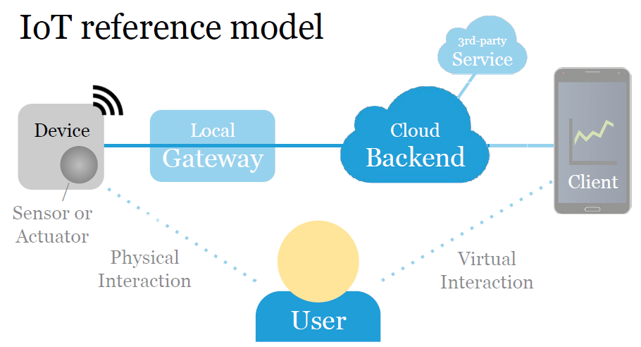

# Actividad de laboratorio 7

> ## Objetivos
> Hacer una primera exploración sobre el uso de APIs para conectar cosas.
> Explorar el uso basico de la herramienta NodeRED.

## Recomendaciones

Antes de empezar se recomienda dar una revisada a los siguientes enlaces:
1. [Adafruit IO](https://learn.adafruit.com/adafruit-io/rest-api)
2. [IoTuesday: Using Yahoo's Weather API](https://www.sparkfun.com/news/2379)
3. [IoT Engineering - https://github.com/tamberg/fhnw-iot/tree/master/03](https://github.com/tamberg/fhnw-iot/tree/master/03)
4. [Solicitudes de API REST](https://github.com/UdeA-IoT/actividad-6#solicitudes-de-api-rest)
5. [Guía práctica para la publicación de Datos Abiertos usando APIs](https://datos.gob.es/es/documentacion/guia-practica-para-la-publicacion-de-datos-abiertos-usando-apis)

## Plataformas IoT

Hasta el momento hemos visto los siguientes temas:
1. Conceptos basicos de programación de las sistemas de desarrollo Arduino UNO y NodeMCU.
2. Algunos conceptos basicos entre sensores y actuadores.
3. Comunicación serial.
4. Comunicación inalambrica usando Wifi.

De los temas anteriormente vistos es importante resaltar la importancia que juega la comunicación en una arquitectura IoT, asi mismo, que estas no son las unicas maneras de hacer trabajar con datos, sin embargo, con saber por ahora esto basta.

Tal y como se muestra en la siguiente figura (tomada de [IoT Engineering - https://github.com/tamberg/fhnw-iot/tree/master/03](https://github.com/tamberg/fhnw-iot/tree/master/03))

En el modelo de referencia IoT, uno de los elementos claves son las plataformas IoT pues permiten almacenar y almacenar (entre otras cosas) datos de sensores. Para conectar las cosas con estas plataformas con las cosas, es importante conocer la forma como se lleva a cabo la comunicación y la interación establecida por estas la cual, generalmente es a traves de peticiones HTTP expuestas a traves de APIs. 

Respecto al manejo de APIs, un documento muy bueno que explica esto se muestra en el resumen [APIs
para Datos Abiertos](references/cheatsheet_api.pdf).

## Sensado remoto

El sensado remoto permite que las cosas envien datos a una plataforma en la nube. A continuación se resumen los pasos que casi siempre se llevan a cabo de manera general para hacer esta tarea:
1. Asegurar que el dispositivo este conectado a la red wifi.
2. Leer los valores de los sensores (al leer valores, es importar agregar un timestamp (UTC) para conocer el momento en el que se hizo la medición).
3. Enviar los valores al backend.

Es importante recordar los pasos basicos para conectar el dispositivo (NodeMCU en nuestro caso) de modo que le recomendamos que de una rapida mirada al documento [3 Steps to Connect an ESP8266 to WiFi for IoT Projects](https://www.learnrobotics.org/blog/connect-esp8266-wifi/)

A continuación se muestran algunas de las plataformas disponibles para enviar y desplegar facilmente datos en la red:
1. https://dweet.io/faq
2. https://platform.favoriot.com/v2/login
3. https://ubidots.com/
4. https://docs.arduino.cc/cloud/iot-cloud
5. https://www.thethingsnetwork.org/
6. https://thethings.io/

## Ejemplos

Con el fin de familiarizarnos un poco con el material teorico previamente presentado vamos a analizar una serie de ejemplos (recopilados de internet) que puede ser de utilidad entender si se desea conectar cosas en una plataforma IoT

1. Haciendo una peticiones Web.
2. Hacerla en el ejemplo 1 del esp8266
3. Traducir lo siguiente:

<!---

Nota: Para la escrutyra del documento sustraer la información basica adaptando lo que se hace cuando se adapta algo usando el arduino cloud iot.

IoT platforms
IoT platforms enable storing/displaying sensor data.
There are many examples, we start with these two:
Dweet.io stores name/value pairs in JSON format.
ThingSpeak stores sensor data and displays graphs.
Both receive data through HTTP POST requests.

Dweet.io
Dweet.io stores name/value pairs in JSON format.
Host: dweet.io
Port: 443
POST /dweet/for/THING_NAME?name=value
POST /dweet/for/THING_NAME?x=23&y=42&t=…
GET /get/dweets/for/THING_NAME
See Wiki for Dweet.io cURL examples. 22

https://github.com/tamberg/fhnw-iot/wiki/IoT-Platforms#dweetio

Hacer una tabla del api del ultimo enlace.

4. Hacer el siguiente ejemplo:

Hands-on, 15': Dweet.io
Dweet.io works without an account, data is public.
Use your ESP8266 MAC address as THING_NAME.
On the ESP8266, read the analog pin A0, then POST
its value to /dweet/for/THING_NAME?a0=value
Use cURL or your browser to read stored data from
https://dweet.io/get/dweets/for/THING_NAME

5. Obtener la MAC del ESP82666

6. Leer A0 del esp8266
Fase 1: 

// Libraries
#include "DHT.h"

void setup() {

  // Start Serial  
  Serial.begin(115200); 
 
  // Init DHT 
  dht.begin();
}

void loop() {

  // Reading temperature and humidity
  

  // Display data
  Serial.print("Humidity: "); 
  Serial.print(h);
  Serial.print(" %\t");
  Serial.print("Temperature: "); 
  Serial.print(t);
  Serial.println(" *C ");
  
   // Wait a few seconds between measurements.
  delay(2000);

}

Fase 2

https://github.com/openhomeautomation/iot-esp8266/blob/master/cloud_data_logger/cloud_data_logger/cloud_data_logger.ino

/***************************************************
Written by Marco Schwartz for Open Home Automation.
BSD license, all text above must be included in any redistribution
Based on the original sketches supplied with the ESP8266/Arduino
implementation written by Ivan Grokhotkov
****************************************************/

// Libraries
#include <ESP8266WiFi.h>
#include "DHT.h"

// WiFi parameters
const char* ssid = "wifi-name";
const char* password = "wifi-pass";

// Pin
#define DHTPIN 5

// Use DHT11 sensor
#define DHTTYPE DHT11

// Initialize DHT sensor
DHT dht(DHTPIN, DHTTYPE, 15);

// Host
const char* host = "dweet.io";

void setup() {

  // Start Serial
  Serial.begin(115200);
  delay(10);

  // Init DHT
  dht.begin();

  // We start by connecting to a WiFi network
  Serial.println();
  Serial.println();
  Serial.print("Connecting to ");
  Serial.println(ssid);
  WiFi.begin(ssid, password);
  while (WiFi.status() != WL_CONNECTED) {
    delay(500);
    Serial.print(".");
  }

  Serial.println("");
  Serial.println("WiFi connected");
  Serial.println("IP address: ");
  Serial.println(WiFi.localIP());
}

void loop() {

  Serial.print("Connecting to ");
  Serial.println(host);

  // Use WiFiClient class to create TCP connections
  WiFiClient client;
  const int httpPort = 80;
  if (!client.connect(host, httpPort)) {
    Serial.println("connection failed");
    return;
  }

  // Reading temperature and humidity
  int h = dht.readHumidity();
  // Read temperature as Celsius
  int t = dht.readTemperature();

  // This will send the request to the server
  client.print(String("GET /dweet/for/myesp8266?temperature=") + String(t) + "&humidity=" + String(h) + " HTTP/1.1\r\n" +
               "Host: " + host + "\r\n" +
               "Connection: close\r\n\r\n");
  delay(10);

  // Read all the lines of the reply from server and print them to Serial
  while(client.available()){
    String line = client.readStringUntil('\r');
    Serial.print(line);
  }

  Serial.println();
  Serial.println("closing connection");

  // Repeat every 10 seconds
  delay(10000);

}

https://dweet.io/follow/node001

6. Leer A0 del esp8266, conectarse a la web y mandar el resultado deet..

Resumen del proceso con: https://www.learnrobotics.org/blog/how-to-use-dweet-io-with-wemos-d1-mini-arduino-tutorial/
https://www.learnrobotics.org/blog/four-steps-to-writing-an-arduino-program/
https://www.learnrobotics.org/
https://www.learnrobotics.org/blog/arduino-data-logger-csv/ (adaptar)
https://www.learnrobotics.org/blog/manufacture-a-pcb/

https://www.learnrobotics.org/blog/connect-esp8266-wifi/
https://www.learnrobotics.org/blog/iot-switch-control-any-device/
https://www.learnrobotics.org/blog/arduino-uno-alternatives-wifi/
https://www.learnrobotics.org/blog/connect-arduino-to-ifttt-for-iot-projects/
https://www.learnrobotics.org/blog/create-a-database-for-iot-using-dweet-io-tutorial/
https://www.learnrobotics.org/blog/internet-of-things-courses-online/

Adaptar a la freeboard... (Internet of things with esp8266)

Poner la actividad con dos plataformas web...

Adaptar el ejemplo con nodered
1. De prender y apagar un led.
2. Adaptar el mismo ejemplo tomado del libro de (Internet of things with esp8266) donde se usa el arest

Hablar sobre los tiempos en los que se toman datos: Network Time Protocol (Diapositivas de https://github.com/tamberg/fhnw-iot)

https://www.home-assistant.io/integrations/dweet/

Basarnos en: https://e-radionica.com/en/blog/dweet-io-croduino-nova/

Ver ademas: https://dweet.io/get/dweets/for/node001

https://dweet.io/get/dweets/for/node001?value

Como acceder

Ver los hadous:https://github.com/tamberg/fhnw-iot-work-03/blob/master/README.md

Ver:
1. https://www.learnrobotics.org/blog/how-to-use-dweet-io-with-wemos-d1-mini-arduino-tutorial/
2. https://synergygallery.renesas.com/media/products/76/178/en-US/Dweet_Library_Users_Guide.pdf
3. https://ria.utn.edu.ar/bitstream/handle/20.500.12272/4575/Proyecto%20Final%20-%20Filgueira%20Javier.pdf?sequence=1&isAllowed=y
4. https://www.learnrobotics.org/blog/how-to-fetch-data-from-dweet-io-using-python-tutorial/
5. https://create.arduino.cc/projecthub/Rjuarez7/arduino-yun-iot-for-home-monitoring-using-dweet-io-b95009
6. https://create.arduino.cc/projecthub/search?q=dweet
7. https://create.arduino.cc/projecthub/carmelito/plant-monitoring-system-using-aws-iot-6cb054?ref=search&ref_id=dweet&offset=1

https://www.learnrobotics.org/blog/connect-arduino-to-ifttt-for-iot-projects/

-->

## Herramientas:

## Rerencias

1. https://github.com/tamberg/fhnw-iot/tree/master/03
2. https://github.com/tamberg/fhnw-iot/wiki/IoT-Platforms#dweetio
3. https://livebook.manning.com/concept/api/http-cheat-sheet
4. https://blog.postman.com/rest-api-examples/
5. https://devhints.io/rest-api
6. https://www.ibm.com/co-es/cloud/learn/rest-apis
7. https://blog.octo.com/wp-content/uploads/2014/10/RESTful-API-design-OCTO-Quick-Reference-Card-2.2.pdf
8. https://www.manning.com/
9. https://www.manning.com/books/using-the-web-to-build-the-iot?query=iot#toc
10. https://www.freecodecamp.org/news/rest-api-best-practices-rest-endpoint-design-examples/
11. http://devices.webofthings.io/
12. https://blog.postman.com/tag/tutorials/
13. https://www.w3.org/WoT/documentation/
