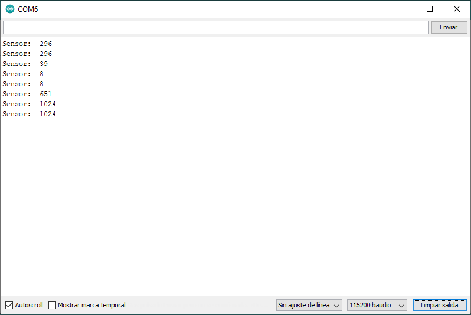

# Ejemplo 2 - Parte 1

Este ejemplo envia serialmente el valor analogo leido a traves del puerto **A0** del **NodeMCU**. El código fue tomado del enlace [ESP8266 ADC – Read Analog Values with Arduino IDE, MicroPython and Lua](https://randomnerdtutorials.com/esp8266-adc-reading-analog-values-with-nodemcu/).

## Codigo

* **Codigo**: [ejemplo2a.ino](ejemplo2a.ino)

```arduino

const int analogInPin = A0; // The only analog pin on the Thing 
int sensorValue = 0;        // Value read from the pot

void setup() {
  // Start Serial  
  Serial.begin(115200);    
}

void loop() {
  // Read the analog in value
  sensorValue  = analogRead(analogInPin);
  
  // Display data  
  Serial.print("Sensor:  ");
  Serial.println(sensorValue);
   
  // Wait a few seconds between measurements.
  delay(2000);
}
```

## Salida

En el monitor serial se puede observar el resultado del código anterior. 



Como se puede apreciar, se despliega un rango de valores entre 0 y 1024 (aproximadamente) los cuales son los valores obtenidos a partir del conversor analogo digital del NodeMCU.